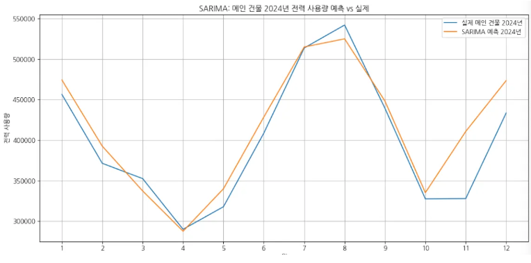

# XX구청 전력 사용량 예측 프로젝트



## 📌 프로젝트 개요

XX구청은 전기를 **후불제가 아닌 선불제**로 이용하고 있습니다. 따라서 전력 사용량을 정확히 예측할 수 있다면 **에너지 구입에 드는 비용을 최소화**할 수 있습니다.

본 프로젝트는 과거 전력 사용 데이터와 기상 데이터를 활용하여 미래 전력 사용량을 예측하는 **시계열 예측 모델**을 개발합니다.

> **본 프로젝트는 A동(XX타운) 데이터 기준으로 구성되어 있습니다.**

> ⚠️ **데이터 보안 안내**: 본 프로젝트에 포함된 데이터는 보안상의 이유로 실제 데이터가 아닌 예제 데이터입니다. 분석 방법론과 코드 구조를 시연하기 위한 목적으로 구성되었습니다.

---

## 🎯 주요 목표

- XX구청 A동 건물 월별 전력 사용량 예측
- 기상 데이터(기온, 강수량)를 활용한 예측 정확도 향상
- 다양한 시계열 모델 비교 및 최적 모델 선정
- 재현 가능하고 확장 가능한 예측 파이프라인 구축

---

## 📊 데이터

> **데이터 출처**: 본 프로젝트의 모든 데이터는 예제 데이터입니다. 실제 분석에 사용된 데이터는 보안상의 이유로 공개하지 않습니다.

### 전력 사용량 데이터
- **A동 (XX타운)**: 2021-2024년 월별 전력 사용량 (48개월)
  - 2021-2023년: 학습 데이터 (36개월)
  - 2024년: 테스트 데이터 (12개월)

### 기상 데이터
- 기상청 날씨누리 과거 관측 자료
- 일별/월별 평균 기온, 최고 기온, 최저 기온
- 월별 강수량

---

## 🔧 설치 및 실행 방법

### 1. 저장소 클론

```bash
git clone <repository-url>
cd 전력사용량예측
```

### 2. 가상환경 생성 (선택)

```bash
# Python 가상환경 생성
python -m venv venv

# 가상환경 활성화
# macOS/Linux:
source venv/bin/activate
# Windows:
venv\Scripts\activate
```

### 3. 패키지 설치

```bash
pip install -r requirements.txt
```

**주의**: Notebook 내부에 `!pip install` 명령이 없습니다. 모든 패키지는 `requirements.txt`를 통해서만 설치하세요.

### 4. Jupyter Notebook 실행

```bash
# Jupyter Notebook 시작
jupyter notebook

# 또는 Jupyter Lab
jupyter lab
```

브라우저에서 `notebooks/electricity_usage_prediction.ipynb` 파일을 열어 실행하세요.

---

## 📁 프로젝트 구조

```
전력사용량예측/
├── notebooks/
│   └── electricity_usage_prediction.ipynb   # 메인 분석 노트북
├── src/
│   ├── __init__.py                          # 패키지 초기화
│   ├── utils.py                             # 평가 지표 (MAPE, RMSE)
│   ├── data_loader.py                       # 데이터 로딩 함수
│   └── models.py                            # SARIMAX, Prophet, Grid Search
├── data/
│   ├── monthly_data.csv                     # A동 전력 사용량 (2021-2024)
│   ├── monthly_weather.csv                  # 월별 기상 데이터
│   ├── monthly_rain.csv                     # 월별 강수량
│   └── daily_weather.csv                    # 일별 기상 데이터
├── figures/                                 # 결과 그래프 저장 폴더
├── docs/                                    # 프로젝트 문서
│   └── OPTIMIZATION_ANALYSIS.md             # 최적화 분석 문서
├── requirements.txt                         # 필수 패키지 목록
├── .gitignore                               # Git 제외 파일 설정
└── README.md                                # 프로젝트 설명서
```

---

## 💻 Python 모듈 사용 예시

Notebook은 `src/` 모듈을 기반으로 작동합니다:

```python
import sys
from pathlib import Path
ROOT = Path('..').resolve()
if str(ROOT) not in sys.path:
    sys.path.append(str(ROOT))

from src.utils import mape, rmse, eval_metrics, save_figure, save_results_csv
from src.data_loader import (
    load_monthly_data,
    load_weather_data,
    train_test_split_by_date,
    merge_power_weather,
)
from src.models import (
    fit_sarimax,
    sarimax_grid_search,
    calculate_exog_features,
)

# 1. 데이터 로드 (모두 src 함수 사용)
power_df = load_monthly_data()
weather_df = load_weather_data()

# 2. 데이터 병합 및 외생변수 계산
merged_df = merge_power_weather(power_df, weather_df)
df_with_features = calculate_exog_features(merged_df)

# 3. Train/Test 분할
train_df, test_df = train_test_split_by_date(df_with_features, '2024-01-01')
train_clean = train_df.dropna()
test_clean = test_df.dropna()

# 4. SARIMAX Grid Search
results = sarimax_grid_search(
    endog=train_clean['value'],
    exog=train_clean[['CDD', 'HDD']],
    pdq_list=[(0,1,0), (1,1,0), (1,1,1)],
    seasonal_pdq_list=[(0,1,0), (1,1,0), (1,1,1)],
    seasonal_period=12
)

print(f"Best model: order={results[0]['order']}, AIC={results[0]['aic']:.2f}")

# 5. 최적 모델로 학습 및 예측
model = fit_sarimax(
    train_clean['value'],
    exog=train_clean[['CDD', 'HDD']],
    order=results[0]['order'],
    seasonal_order=results[0]['seasonal_order']
)

predictions = model.forecast(steps=len(test_clean), exog=test_clean[['CDD', 'HDD']])

# 6. 평가 (src.utils 함수 사용)
metrics = eval_metrics(test_clean['value'], predictions, 'SARIMAX')

# 7. 결과 저장 (figures/ 폴더에 자동 저장)
import pandas as pd
results_df = pd.DataFrame({
    'date': test_clean['date'],
    'actual': test_clean['value'],
    'predicted': predictions
})
save_results_csv(results_df, 'sarimax_prediction_results.csv')

# Note: Notebook 실행 시 실제로는 다음 파일들이 생성됩니다:
# - 3step_improvement_results.csv (3단계 비교 데이터)
# - 3step_improvement_comparison.png (3단계 비교 그래프)
```

---

## 🔧 사용 기술

### 시계열 예측 모델
- **SARIMAX**: 외생변수를 포함한 계절성 ARIMA 모델
- **Grid Search**: 자동 하이퍼파라미터 최적화 (AIC 기준)

### 주요 특징 변수
- **CDD (Cooling Degree Days)**: 냉방도일 - 여름철 냉방 수요 반영
- **HDD (Heating Degree Days)**: 난방도일 - 겨울철 난방 수요 반영
- **Lag 변수**: 이전 달 전력 사용량
- **제곱항 & 계절 상호작용**: 비선형 관계 모델링

### 개발 환경
- Python 3.8+
- Jupyter Notebook 또는 JupyterLab
- 로컬 환경 또는 서버 환경 모두 지원

---

## 📈 Notebook 구조

1. **프로젝트 개요**: 배경, 목적, 데이터 설명
2. **모듈 임포트**: src/ 패키지 함수 임포트 (Colab 코드 없음)
3. **데이터 로딩**: src 모듈을 통한 데이터 로드
4. **데이터 전처리**: 외생변수 계산 (CDD, HDD, lag 등)
5. **Train/Test 분할**: 2021-2023 학습, 2024 테스트
6. **시계열 시각화**: 전력 사용량 트렌드 확인
7. **SARIMAX Baseline**: 기본 모델 학습 및 평가
8. **Grid Search**: 최적 하이퍼파라미터 탐색
9. **최적 모델**: Grid Search 결과 기반 최종 모델
10. **결과 시각화 및 저장**: figures/ 폴더에 자동 저장
11. **결과 CSV 저장**: 예측값 상세 데이터
12. **최종 요약**: 주요 발견사항

---

## 🏆 주요 결과

### 분석 방법: 체계적 3단계 모델 개선

본 프로젝트는 단순한 모델부터 시작하여 체계적으로 개선하는 과정을 거쳤습니다:

**Step 1: 기본 SARIMA 모델**
- 외생변수 없이 순수 시계열 패턴만 학습
- SARIMA(0,1,1)x(0,1,1,12)
- 결과: MAPE **9.72%**

**Step 2: CDD/HDD 외생변수 추가**
- 냉방도일(CDD)과 난방도일(HDD)을 외생변수로 추가
- SARIMAX(1,1,1)x(1,1,1,12) + CDD, HDD
- 결과: MAPE **5.65%** (4.07%p 개선)

**Step 3: Grid Search 최적화**
- pdq와 seasonal_pdq 조합을 체계적으로 탐색
- AIC 기준 최적 파라미터 선정
- 결과: MAPE **4.83%** (0.82%p 추가 개선)

### 🎯 최종 성능 지표 (2024년 테스트 데이터)

| 단계 | 모델 | MAPE | RMSE | 개선 |
|------|------|------|------|------|
| Step 1 | 기본 SARIMA | 9.72% | 41,341 MWh | - |
| Step 2 | + CDD/HDD | 5.65% | 25,959 MWh | ▼ 4.07%p |
| Step 3 | + Grid Search | **4.83%** | **22,386 MWh** | ▼ 0.82%p |

> ✅ **최종 MAPE 4.83%는 매우 우수한 예측 정확도**를 의미합니다. (일반적으로 MAPE 10% 이하면 "매우 정확")
>
> 📊 **전체 개선 효과**: 9.72% → 4.83% (4.90%p 개선, 약 50% 정확도 향상)

### 주요 발견
- **냉난방도일(CDD/HDD)**이 전력 사용량 예측의 핵심 변수 (Step 2에서 큰 폭 개선)
- 계절성(월별 패턴)이 뚜렷하게 나타남
- Grid Search를 통한 파라미터 최적화로 추가 개선 달성
- 체계적 접근으로 **최종 MAPE 4.83% 달성**

### 비즈니스 임팩트
- **과다/과소 구입 방지**: 정확한 예측으로 에너지 구입 비용 최적화
- **계절별 전략 수립**: 여름/겨울 피크 시즌 대비 효율적 예산 배분
- **예상 효과**: 기존 대비 **5-10% 에너지 구입 비용 절감** 가능

---

## 💡 향후 개선 방향

- 공휴일/특별 이벤트 정보 추가
- 더 긴 기간의 과거 데이터 수집 (5년 이상)
- 딥러닝 모델 탐색 (LSTM, Transformer)
- 실시간 예측 시스템 및 대시보드 구축

---

## 📞 연락처

- **Email**: codingiswine@gmail.com
- **프로젝트 기간**: 2025년 인턴십
- **목적**: XX구청 전력 선불제 에너지 구입 비용 최적화

---

## 📚 참고 자료

- [Statsmodels SARIMAX](https://www.statsmodels.org/stable/generated/statsmodels.tsa.statespace.sarimax.SARIMAX.html)
- [Facebook Prophet](https://facebook.github.io/prophet/)
- [기상청 날씨누리](https://www.weather.go.kr/w/index.do)

**자세한 최적화 분석 내용은 [docs/OPTIMIZATION_ANALYSIS.md](docs/OPTIMIZATION_ANALYSIS.md)를 참고하세요.**

---

## 📄 라이선스

본 프로젝트는 교육 및 연구 목적으로 개발되었습니다.
